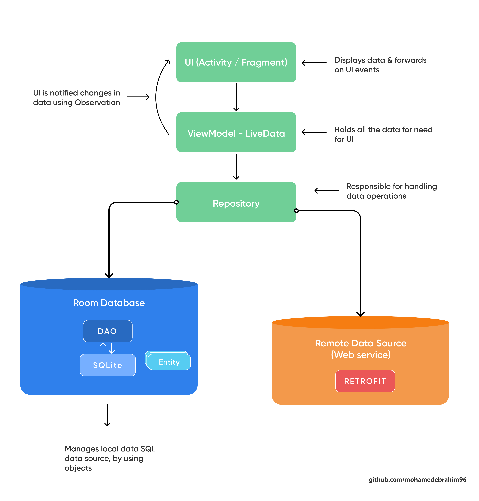

# Crownwealth (Android) 📱

_**Crownwealth Android application**_ is built with _Modern Android application development_ tools or libraries. 
Aim of this project is to showcase Good practice implementation of Android application development with proper architecture design. 
_Dedicated to all Android Developers with_ ❤️.

## Features  👓

The codebase focuses on following key things:

- [x] Single Activity Design
- [x] Offline Capability - Notes ✈️
- [x] Clean and Simple Material UI 🎨
- [x] Dark mode 🌗
- [x] Jetpack Compose UI
- [ ] Tests ***(WIP)***

